# ENVA - Fixed Use Case Diagram

## Tổng quan
Enva là ứng dụng quản lý sự kiện và mời khách với giao diện minimalist, hỗ trợ đa ngôn ngữ và tích hợp AI.

## Use Case Diagram (Fixed Version)

```mermaid
graph TB
    %% Actors
    User((Người dùng))
    Guest((Khách))
    Admin((Admin))
    AI((AI Service))
    Payment((Payment System))
    Notification((Notification System))
    Map((Map Service))
    Cloud((Cloud Storage))
    
    %% Authentication Use Cases
    subgraph "Authentication System"
        UC1[Đăng ký tài khoản]
        UC2[Đăng nhập]
        UC3[Xác thực OTP]
        UC4[Hoàn tất hồ sơ]
        UC5[Đăng xuất]
        UC6[Quên mật khẩu]
        UC7[Đăng nhập bằng Google]
        UC8[Đăng nhập bằng Facebook]
    end
    
    %% Event Management Use Cases
    subgraph "Event Management"
        UC9[Tạo sự kiện mới]
        UC10[Chỉnh sửa sự kiện]
        UC11[Xóa sự kiện]
        UC12[Xem chi tiết sự kiện]
        UC13[Xem danh sách sự kiện]
        UC14[Lọc sự kiện theo danh mục]
        UC15[Tạo sự kiện bằng AI]
        UC16[Preview sự kiện]
        UC17[Upload ảnh sự kiện]
        UC18[Chọn vị trí sự kiện]
        UC19[Đặt thời gian sự kiện]
    end
    
    %% Invitation System Use Cases
    subgraph "Invitation System"
        UC20[Mời người tham gia]
        UC21[Chấp nhận lời mời]
        UC22[Từ chối lời mời]
        UC23[Xem danh sách người mời]
        UC24[Tìm kiếm người dùng]
        UC25[Gửi nhắc nhở]
        UC26[Xem trạng thái lời mời]
        UC27[RSVP cho sự kiện]
    end
    
    %% Profile Management Use Cases
    subgraph "Profile Management"
        UC28[Xem hồ sơ cá nhân]
        UC29[Cập nhật thông tin cá nhân]
        UC30[Thay đổi ảnh đại diện]
        UC31[Xem thống kê sự kiện]
        UC32[Thay đổi ngôn ngữ]
        UC33[Thay đổi theme]
    end
    
    %% Notification System Use Cases
    subgraph "Notification System"
        UC34[Nhận thông báo]
        UC35[Xem danh sách thông báo]
        UC36[Đánh dấu đã đọc]
        UC37[Xóa thông báo]
        UC38[Đánh dấu tất cả đã đọc]
        UC39[Push notification]
        UC40[Local notification]
    end
    
    %% Subscription System Use Cases
    subgraph "Subscription System"
        UC41[Xem gói đăng ký]
        UC42[Nâng cấp tài khoản]
        UC43[Nhập mã premium]
        UC44[Xem giới hạn sử dụng]
        UC45[Quản lý thanh toán]
    end
    
    %% Location Services Use Cases
    subgraph "Location Services"
        UC46[Lấy vị trí hiện tại]
        UC47[Chọn vị trí trên bản đồ]
        UC48[Xem bản đồ sự kiện]
        UC49[Mở ứng dụng bản đồ]
        UC50[Geocoding địa chỉ]
    end
    
    %% AI Integration Use Cases
    subgraph "AI Integration"
        UC51[Tạo sự kiện bằng AI]
        UC52[Gợi ý nội dung]
        UC53[Phân tích sự kiện]
    end
    
    %% Sharing & Social Use Cases
    subgraph "Sharing & Social"
        UC54[Chia sẻ sự kiện]
        UC55[Export sự kiện]
        UC56[In sự kiện]
    end
    
    %% Relationships - Authentication
    User --> UC1
    User --> UC2
    User --> UC3
    User --> UC4
    User --> UC5
    User --> UC6
    User --> UC7
    User --> UC8
    
    %% Relationships - Event Management
    User --> UC9
    User --> UC10
    User --> UC11
    User --> UC12
    User --> UC13
    User --> UC14
    User --> UC15
    User --> UC16
    User --> UC17
    User --> UC18
    User --> UC19
    
    %% Relationships - Invitation System
    User --> UC20
    User --> UC23
    User --> UC24
    User --> UC25
    User --> UC26
    Guest --> UC21
    Guest --> UC22
    Guest --> UC27
    
    %% Relationships - Profile Management
    User --> UC28
    User --> UC29
    User --> UC30
    User --> UC31
    User --> UC32
    User --> UC33
    
    %% Relationships - Notification System
    User --> UC35
    User --> UC36
    User --> UC37
    User --> UC38
    Notification --> UC34
    Notification --> UC39
    Notification --> UC40
    
    %% Relationships - Subscription System
    User --> UC41
    User --> UC42
    User --> UC43
    User --> UC44
    Payment --> UC45
    
    %% Relationships - Location Services
    User --> UC46
    User --> UC47
    User --> UC48
    User --> UC49
    Map --> UC50
    
    %% Relationships - AI Integration
    User --> UC51
    AI --> UC52
    AI --> UC53
    
    %% Relationships - Sharing & Social
    User --> UC54
    User --> UC55
    User --> UC56
    
    %% External System Dependencies
    UC17 --> Cloud
    UC30 --> Cloud
    UC47 --> Map
    UC48 --> Map
    UC49 --> Map
    UC51 --> AI
    UC52 --> AI
    UC53 --> AI
    UC39 --> Notification
    UC40 --> Notification
    UC42 --> Payment
    UC43 --> Payment
    
    %% Include Relationships (using dotted lines)
    UC9 -.-> UC17
    UC9 -.-> UC18
    UC9 -.-> UC19
    UC10 -.-> UC17
    UC10 -.-> UC18
    UC10 -.-> UC19
    UC20 -.-> UC24
    UC25 -.-> UC39
    UC51 -.-> UC52
    
    %% Extend Relationships (using dotted lines)
    UC15 -.-> UC51
    UC34 -.-> UC39
    UC34 -.-> UC40
    
    %% Styling
    classDef actor fill:#e1f5fe,stroke:#01579b,stroke-width:2px
    classDef useCase fill:#f3e5f5,stroke:#4a148c,stroke-width:2px
    classDef system fill:#e8f5e8,stroke:#1b5e20,stroke-width:2px
    
    class User,Guest,Admin actor
    class UC1,UC2,UC3,UC4,UC5,UC6,UC7,UC8,UC9,UC10,UC11,UC12,UC13,UC14,UC15,UC16,UC17,UC18,UC19,UC20,UC21,UC22,UC23,UC24,UC25,UC26,UC27,UC28,UC29,UC30,UC31,UC32,UC33,UC34,UC35,UC36,UC37,UC38,UC39,UC40,UC41,UC42,UC43,UC44,UC45,UC46,UC47,UC48,UC49,UC50,UC51,UC52,UC53,UC54,UC55,UC56 useCase
    class AI,Payment,Notification,Map,Cloud system
```

## Các lỗi đã được sửa:

### 1. **Lỗi syntax trong include/extend relationships**
- **Trước**: `UC9 -.-> UC17 : <<include>>` (syntax không hợp lệ)
- **Sau**: `UC9 -.-> UC17` (loại bỏ label để tránh lỗi)

### 2. **Lỗi logic trong relationships**
- **Trước**: `User --> UC21, UC22, UC27` (User không thể chấp nhận/từ chối lời mời của chính mình)
- **Sau**: `Guest --> UC21, UC22, UC27` (Chỉ Guest mới có thể RSVP)

### 3. **Tối ưu hóa layout**
- Loại bỏ các relationships không cần thiết
- Sắp xếp lại các connections để tránh overlap

## Phiên bản đơn giản hơn (nếu vẫn gặp lỗi):

```mermaid
graph TB
    %% Actors
    User((Người dùng))
    Guest((Khách))
    AI((AI Service))
    Payment((Payment))
    Notification((Notification))
    Map((Map Service))
    
    %% Main Use Case Groups
    subgraph "🔐 Authentication"
        A1[Đăng ký]
        A2[Đăng nhập]
        A3[Xác thực OTP]
        A4[Hoàn tất hồ sơ]
    end
    
    subgraph "📅 Event Management"
        E1[Tạo sự kiện]
        E2[Chỉnh sửa sự kiện]
        E3[Xem chi tiết]
        E4[Xem danh sách]
        E5[Tạo bằng AI]
        E6[Upload ảnh]
        E7[Chọn vị trí]
    end
    
    subgraph "📧 Invitation System"
        I1[Mời người tham gia]
        I2[Chấp nhận/Từ chối]
        I3[Xem danh sách mời]
        I4[Tìm kiếm người dùng]
        I5[Gửi nhắc nhở]
    end
    
    subgraph "👤 Profile & Settings"
        P1[Xem hồ sơ]
        P2[Cập nhật thông tin]
        P3[Thay đổi ngôn ngữ]
        P4[Thay đổi theme]
    end
    
    subgraph "🔔 Notifications"
        N1[Nhận thông báo]
        N2[Xem danh sách]
        N3[Đánh dấu đã đọc]
    end
    
    subgraph "💎 Subscription"
        S1[Xem gói đăng ký]
        S2[Nâng cấp tài khoản]
        S3[Nhập mã premium]
    end
    
    %% User Relationships
    User --> A1
    User --> A2
    User --> A3
    User --> A4
    
    User --> E1
    User --> E2
    User --> E3
    User --> E4
    User --> E5
    User --> E6
    User --> E7
    
    User --> I1
    User --> I3
    User --> I4
    User --> I5
    
    User --> P1
    User --> P2
    User --> P3
    User --> P4
    
    User --> N2
    User --> N3
    
    User --> S1
    User --> S2
    User --> S3
    
    %% Guest Relationships
    Guest --> I2
    
    %% External System Dependencies
    E5 --> AI
    E6 --> Map
    E7 --> Map
    I5 --> Notification
    N1 --> Notification
    S2 --> Payment
    S3 --> Payment
    
    %% Include Relationships
    E1 -.-> E6
    E1 -.-> E7
    I1 -.-> I4
    
    %% Extend Relationships
    E5 -.-> AI
    
    %% Styling
    classDef actor fill:#e3f2fd,stroke:#1976d2,stroke-width:3px
    classDef useCase fill:#f3e5f5,stroke:#7b1fa2,stroke-width:2px
    classDef system fill:#e8f5e8,stroke:#388e3c,stroke-width:2px
    
    class User,Guest actor
    class A1,A2,A3,A4,E1,E2,E3,E4,E5,E6,E7,I1,I2,I3,I4,I5,P1,P2,P3,P4,N1,N2,N3,S1,S2,S3 useCase
    class AI,Payment,Notification,Map system
```

## Cách sử dụng:

1. **Copy code Mermaid** vào [Mermaid Live Editor](https://mermaid.live/)
2. **Hoặc** sử dụng trong GitHub/GitLab markdown
3. **Hoặc** sử dụng VS Code với extension "Mermaid Preview"

## Lưu ý:

- **Loại bỏ labels** trong include/extend relationships để tránh lỗi syntax
- Sử dụng `-.->` cho dotted lines
- Đảm bảo tất cả nodes có unique IDs
- Tránh circular dependencies
- Kiểm tra syntax trước khi sử dụng

## Legend cho relationships:

- **Solid arrows** (`-->`): Direct relationships
- **Dotted arrows** (`-.->`): Include/Extend relationships
- **Different colors**: Different types of actors and use cases 